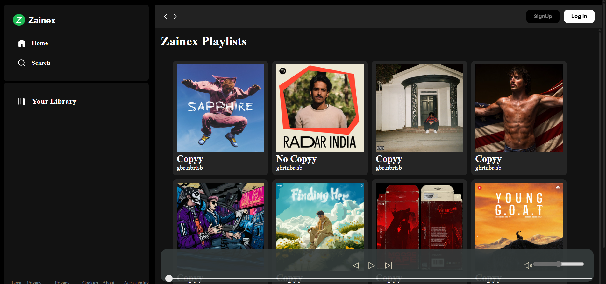

# 🎵 Music Player Web App

A fully functional web-based music player that allows users to create playlists, add songs, and enjoy seamless audio playback directly from their browser.

## Features

- **Playlist Management** — Create playlists and add your favorite songs.
- **Playback Controls** — Play, pause, go to next/previous track.
- **Volume Control** — Adjust the volume as per your preference.
- **Seekbar** — Seek to any position in the currently playing song.
- **Responsive UI** — Clean and responsive design for desktop and mobile.

## Technologies Used

- **HTML5** — Structure of the web app.
- **CSS3 / Flexbox / Grid** — Styling and responsive design.
- **JavaScript** — Audio handling and interactivity.

## Future Improvements

- User authentication & login
- Saving playlists to backend (localStorage, database, etc.)
- Album art & metadata display
- Shuffle & repeat options
- Mobile-first design improvements
and many more...

## Screenshots

## 🔧 Setup & Usage

Open `index.html` in any web browser and start using!
